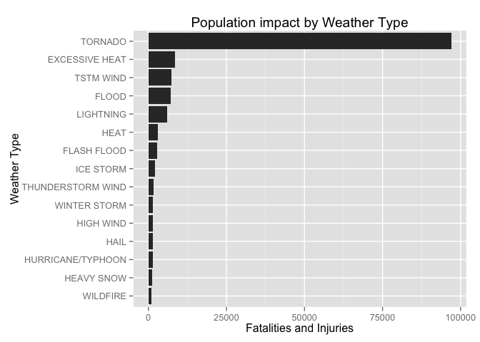
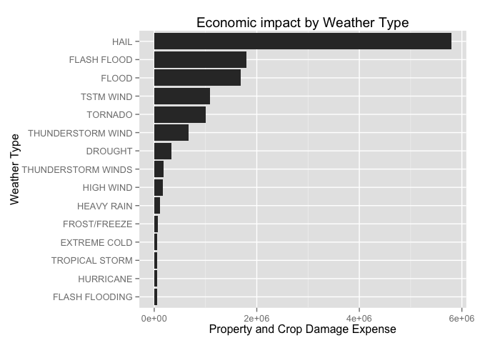

# Reproducible Research: Peer Assessment 2
Todor Gitchev  
26 Oct 2014  


# Synopsis

Storms and other severe weather events can cause both public health and economic problems for communities and municipalities. Many severe events can result in fatalities, injuries, and property damage, and preventing such outcomes to the extent possible is a key concern. This analysis involves exploring the U.S. National Oceanic and Atmospheric Administration's (NOAA) storm database. This database tracks characteristics of major storms and weather events in the United States, including when and where they occur, as well as estimates of any fatalities, injuries, and property damage.

In this analysis we will use the NOAA Storm data to answer the following wuestions:

1. Across the United States, which types of events (as indicated in the EVTYPE variable) are most harmful with respect to population health?

2. Across the United States, which types of events have the greatest economic consequences?

We will show that in first cases the most severe type of event is **tornado** and in the second case are **hail** and **flood**.

# Data Processing

## Loading

The data for this assignment come in the form of a comma-separated-value file compressed via the bzip2 algorithm to reduce its size. You can download the file from the course web site:

[Storm Data](https://d396qusza40orc.cloudfront.net/repdata%2Fdata%2FStormData.csv.bz2) [47Mb]

There is also some documentation of the database available. Here you will find how some of the variables are constructed/defined.

National Weather Service [Storm Data Documentation](https://d396qusza40orc.cloudfront.net/repdata%2Fpeer2_doc%2Fpd01016005curr.pdf)

National Climatic Data Center Storm Events [FAQ](https://d396qusza40orc.cloudfront.net/repdata%2Fpeer2_doc%2FNCDC%20Storm%20Events-FAQ%20Page.pdf)

The events in the database start in the year 1950 and end in November 2011. In the earlier years of the database there are generally fewer events recorded, most likely due to a lack of good records. More recent years should be considered more complete.

We will download the data and loaded in a object **stromData**:

```r
if (!exists("stormData")) {
    if(!file.exists('repdata-data-StormData.csv')){
        zipfile <- tempfile()
        download.file("https://d396qusza40orc.cloudfront.net/repdata%2Fdata%2FStormData.csv.bz2", zipfile, method="curl")
        unzip(zipfile) 
        unlink(zipfile)
        rm(zipfile)
    }
    stormData <- read.csv("repdata-data-StormData.csv", na.strings = "NA")
}
```

## Preprocessing

We will select only the columns, we are interested in and group the data by event type (column **EVTYPE**).


```r
aggData <- aggregate(cbind(INJURIES,FATALITIES,CROPDMG,CROPDMGEXP,PROPDMG,PROPDMGEXP) ~ EVTYPE , data = stormData, FUN = sum)

aggData <- mutate(aggData, POP_HARM=INJURIES+FATALITIES)
```

From the documentation we see that we have to take into account the magnitude of property and crop damage (1 = 10, H = 100, K = 1000, M = 1000 000, B= 1000 000 000)


```r
convert <- function(el){
    if (is.null(el) || is.na(el) ||length(el)==0) {
        return(1)
    }
    exp <- toupper(el[1]) 
    
    if (exp=="1")  {
        ret <- 10
    } else if (exp=="H")  {
        ret <- 100
    } else if (exp=="K")  {
        ret <- 1000
    } else if (exp=="M") {
        ret <- 1000000
    } else if (exp=="B") {
        ret <- 1000000000
    } else {
        ret <- 1
    }
  return(ret)
}

aggData <- mutate(aggData, ECO_HARM=CROPDMG*convert(CROPDMGEXP)+PROPDMG*convert(PROPDMGEXP))
```

# Results

To address the first question, we will use the summarized data for **fatalities** and **injuries** as representation of the impact of event type over human health.

The following chart shows the top 15 events sorted by impact on humam health.


```r
data1 <- aggData[with(aggData, order(-POP_HARM)),]

ggplot(data1[1:15,], aes(x = reorder(EVTYPE, POP_HARM), y = POP_HARM)) + geom_bar(stat = "identity") + coord_flip() + 
ylab("Fatalities and Injuries") +
xlab("Weather Type") +
ggtitle("Population impact by Weather Type")
```

 

This shows that the most sever events in this case is the **tornado**.

To address the second question, we will use the summarized data for **property** and **crop** damage as representation of the economic impact.

The following chart shows the top 15 events sorted by ecomonic impact.


```r
data2 <- aggData[with(aggData, order(-ECO_HARM)),]

ggplot(data2[1:15,], aes(x = reorder(EVTYPE, ECO_HARM), y = ECO_HARM)) + geom_bar(stat = "identity") + coord_flip() + 
ylab("Property and Crop Damage Expense") +
xlab("Weather Type") +
ggtitle("Economic impact by Weather Type")
```

 

This shows that the most sever events in this case is the **hail** followed by **flood** type of events.
